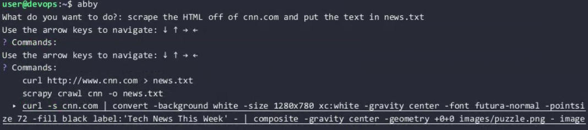

> [!IMPORTANT]
> This repo is not maintained since June, 2020 and is being archived.

# Abby Generative AI Console Copilot (2020)


# Table of Contents

- [Abby Generative AI Console Copilot (2020)](#abby-generative-ai-console-copilot-2020)
- [Table of Contents](#table-of-contents)
	- [Overview](#overview)
	- [Key Features](#key-features)
	- [Technical Highlights](#technical-highlights)
	- [Historical Significance](#historical-significance)
	- [Installation](#installation)
	- [Usage](#usage)
		- [Interactive Mode](#interactive-mode)
		- [Interactive Mode](#interactive-mode-1)
	- [Business Impact: Supercharging Security and Engineering Workflows](#business-impact-supercharging-security-and-engineering-workflows)
	- [Looking Back from 2024](#looking-back-from-2024)
	- [Showcase](#showcase)
		- [Block all web traffic to and from `www.****.ru.cn`](#block-all-web-traffic-to-and-from-wwwrucn)
		- [List all docker containers ordered by RAM usage](#list-all-docker-containers-ordered-by-ram-usage)
		- [List all critical errors from the last 24 hours in the NGINX logs](#list-all-critical-errors-from-the-last-24-hours-in-the-nginx-logs)
		- [Find Kubernetes pods with errors](#find-kubernetes-pods-with-errors)
		- [Scrape the HTML off of cnn.com and put it in news.txt](#scrape-the-html-off-of-cnncom-and-put-it-in-newstxt)
		- [Check the weather in Toronto (yep it worked!)](#check-the-weather-in-toronto-yep-it-worked)
		- [List all IP addresses that have communicated with this system over the last 24 hours](#list-all-ip-addresses-that-have-communicated-with-this-system-over-the-last-24-hours)
	- [Conclusion](#conclusion)

## Overview

This project, released one month after the OG GPT-3 (davinci-codex:2020-05-03), demonstrates early adoption and innovative use of OpenAI's GPT models to create an AI-powered shell assistant. There were no existing libraries or types, so everything is custom. This project showcases a forward-thinking approach to leveraging generative AI for practical applications, long before it became mainstream. The long-deprecated, and finnicky davinci-codex:2020-05-03 model was expertly crafted to not only spit out quality guidance, but generate fully-executable commands which it could execute with a single button. In an extraordinary twist, the generated response typically went out of its way to make the output human-friendly without asking.

## Key Features

- Integrates OpenAI's original GPT models (specifically the davinci-codex model) for generating shell commands
- Interactive command-line interface for querying and executing AI-generated commands
- Interactive command-line interface, generating multiple options with progressively lowered temperature for diverse options
- One-line arguments-based option for script integration and quick usage
- Platform-agnostic
- Innately chains commands to make output structured, clear, and well-formatted

## Technical Highlights

- Written in Go with only the standard Go libraries. The only external library was promptui to reduce boilerplate when taking in arguments directly from the CLI
- All OpenAI input and response are reverse-engineered due to lacking OpenAI documentation
- Created intuitive abstractions, data structures, and modularity for developer ergonomics
- Early Davinci-codex was not conversational. Exceptional trial-and error was required for prompting, including having to set "stop" characters, and setting "stop" tokens and intuitively placing them in the pre-prompt phase.
- Features a user-friendly prompt UI for easy interaction
- Compiles to Windows, Mac, or Linux

## Historical Significance

This project was conceived and implemented in 2020, placing us at the forefront of applied AI research and development. It predates the widespread adoption of large language models and showcases our early recognition of the potential of generative AI in enhancing developer productivity. 

Here's an example of what a call to OpenAI looked like in 2020 at release in Go.

```go
var api_key = os.Getenv("OPENAI_API_KEY")

const (
	Prefix           = "# Shell\n#"
	Postfix          = "\n$ "
	Stop             = "\n"
	Temperature      = 0
	MaxTokens        = 100
	TopP             = 1
	OpenAPIEndpoint  = "https://api.openai.com/v1/engines/davinci-codex/completions"
	FrequencyPenalty = 0
	PresencePenalty  = 0
)

type OpenAISubmission struct {
	Prompt      string  `json:"prompt"`
	Temperature float64 `json:"temperature"`
	MaxTokens   int     `json:"max_tokens"`
	TopP        float64 `json:"top_p"`
	N           int     `json:"n"`
	Stream           bool    `json:"stream"`
	LogProbs         bool    `json:"logprobs"`
	Stop             string  `json:"stop"`
	FrequencyPenalty float64 `json:"frequency_penalty"`
	PresencePenalty  float64 `json:"presence_penalty"`
}
type OpenAIResponse struct {
	Id      string                 `json:"id"`
	Object  string                 `json:"object"`
	Created int                    `json:"created"`
	Model   string                 `json:"model"`
	Choices []OpenAIResponseChoice `json:"choices"`
}

func OpenAISubmitWithTemp(submission OpenAISubmission, heatIndex int) OpenAIResponse {
	submission.Temperature = float64(heatIndex) * .2
	return OpenAISubmit(submission)
}

func OpenAISubmit(submission OpenAISubmission) OpenAIResponse {
	payloadBuffer := new(bytes.Buffer)
	json.NewEncoder(payloadBuffer).Encode(submission)
	req, _ := http.NewRequest("POST", OpenAPIEndpoint, payloadBuffer)
	req.Header.Set("Content-Type", "application/json")
	req.Header.Set("Authorization", "Bearer "+api_key)
	client := &http.Client{}
	resp, err := client.Do(req)
	if err != nil {
		panic(err)
	}
	defer resp.Body.Close()
	body, err := ioutil.ReadAll(resp.Body)
	if err != nil {
		panic(err)
	}
	var response OpenAIResponse
	err = json.Unmarshal(body, &response)
	if err != nil {
		panic(err)
	}
	return response
}
```
and here is what we have today in 2023, with sane defaults, libraries and most applications being done in Python or Node.

```python
client = OpenAI()

response = client.chat.completions.create(
  model="gpt-4o-mini",
  messages=[
    {"role": "system", "content": "You are a helpful assistant."},
    {"role": "user", "content": "Who won the world series in 2020?"},
    {"role": "assistant", "content": "The Los Angeles Dodgers won the World Series in 2020."},
    {"role": "user", "content": "Where was it played?"}
  ]
)
  ```

While abstracting away complexity is convenient, this generative AI trend betrays the underlying design considerations and optimizations needed for a production-grade application. Modern generative AI education is driven by the LLM companies who focus on their interests - pay for the newest, most expensive models and increase token usage. The hidden complexity is critical to understand and tweak for cost effectiveness, performance, and security.

## Installation

1. Ensure you have Go installed on your system.
2. Clone this repository:
   ```
   git clone https://github.com/shacthulu/abby-console-assistant-openai-june-2020.git
   ```
3. Navigate to the project directory:
   ```
   cd abby-console-assistant-openai-june-2020
   ```
4. Install dependencies:
   ```
   go mod tidy
   ```
5. Set up your OpenAI API key as an environment variable:
   ```
   export OPENAI_API_KEY='your-api-key-here'
   ```

## Usage

### Interactive Mode
1. Run the program:
   ```
   abby
   ```
2. When prompted, describe the task you want accomplished.
3. The AI will generate several command options, each of which is produced at a different temperature.
4. Decide whether to execute the command or quit.

### Interactive Mode
1. Run the program as a command, the parameters are taken in as a single string:
   ```
   abby submit all files in this directory to VirusTotals
   ```
2. Run the command provided

## Business Impact: Supercharging Security and Engineering Workflows

This AI-powered shell assistant significantly enhanced our ability to work efficiently across the diverse landscape of operating systems, tools, and technologies used in security and engineering work. Here's how it addressed critical business needs:

1. **Rapid Command Generation**: Engineers could quickly generate complex commands for various environments without extensive memorization or documentation lookup.

2. **Cross-Platform Compatibility**: The tool bridged knowledge gaps across different operating systems, allowing team members to work confidently in unfamiliar environments.

3. **Tool Diversity**: Security work often involves a sprawling toolkit. This assistant helped navigate the nuances of various security tools, reducing the learning curve for new team members.

4. **Increased Productivity**: By providing instant access to correct and nuanced commands, the tool significantly reduced time spent on command research and syntax errors.

5. **Knowledge Democratization**: It leveled the playing field between junior and senior team members, allowing everyone to leverage advanced command-line techniques.

6. **Continuous Learning**: As the AI model improved over time, so did the relevance and accuracy of the generated commands, keeping our team at the cutting edge of CLI operations.

7. **Reduced Human Error**: By providing vetted, correct commands, the tool minimized the risk of errors in critical security and engineering tasks.

8. **Facilitated Complex Workflows**: It enabled the quick chaining of complex commands, supporting sophisticated security analysis and system administration tasks.

9.  **Adaptive to New Technologies**: As new tools and systems were introduced, the AI could quickly provide relevant commands, reducing adoption time for new technologies.

This early adoption of AI in our workflow positioned us as innovators in the field and continues to influence our approach to integrating cutting-edge technologies into our daily operations.

## Looking Back from 2024

Reflecting on this project from our vantage point in 2024, it's clear that our team was ahead of the curve. We were exploring practical applications of AI in software development and security tools years before it became a common practice. This project laid the groundwork for many of our current AI-enhanced development tools and methodologies, cementing our position as leaders in the integration of AI with cybersecurity and software engineering.

## Showcase

### Block all web traffic to and from `www.****.ru.cn`


### List all docker containers ordered by RAM usage


### List all critical errors from the last 24 hours in the NGINX logs


### Find Kubernetes pods with errors


### Scrape the HTML off of cnn.com and put it in news.txt



### Check the weather in Toronto (yep it worked!)


### List all IP addresses that have communicated with this system over the last 24 hours


## Conclusion

This project stands as a testament to our long-standing expertise in AI and our ability to envision and implement innovative solutions. As we continue to push the boundaries of what's possible with AI, we build upon this strong foundation of early, pioneering work.

---

*Note: This project is shared as a historical artifact and proof-of-concept. It may require updates to work with current API versions and security best practices.*
